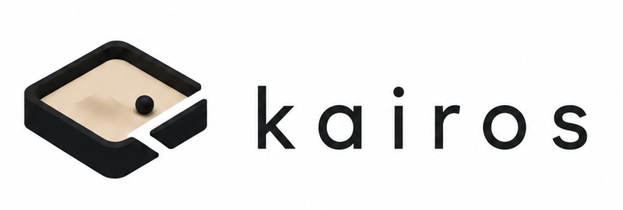

# Kairos

<p align="center">
  
</p>

English | [简体中文](README.zh-CN.md)

[](https://github.com/ScienJus/kairos/actions/workflows/ci.yml)
[](https://github.com/ScienJus/kairos/actions/workflows/security.yml)
[](LICENSE)

Kairos coordinates tasks shared by people and agents.

Agent harnesses such as Codex and Claude Code are good at running an agent. Kairos focuses on the collaboration around those agents: what work exists, who is responsible for it, what has already been delivered, and what can happen next.

It does not start or stop agents, choose models, or manage sandboxes. The current integration model lets agents connect proactively through MCP / Skills; a planned Bridge will dispatch Tasks to a harness when automated startup is needed.

## Why Kairos

Kairos gives every participant one durable view of the work:

- people and agents discover Tasks from the same WorkItem;
- an atomic Claim prevents two executors from working on the same Task at once;
- submissions, Reviews, feedback, and failures remain with the Task instead of an agent session;
- named Artifacts keep Git commits, branches, documents, reports, and managed files addressable across Tasks;
- Tasks can be executed by an agent, a person, or either;
- both structured processes and open-ended collaboration use the same execution protocol.

```text
find work → choose → claim → execute + heartbeat → submit → complete
                                                  └── Review → approve / reject
```

## Choose a Coordination Mode

| Use | When it fits |
| --- | --- |
| **Workflow** | The process is known in advance and the system must enforce dependencies and required steps. |
| **Blackboard** | The objective is clear, but the plan should evolve as people and agents learn during execution. |

### Workflow

Workflow defines the legal choice space while allowing executors to make decisions at configured points.

Supported collaboration capabilities:

- **Dependencies**: downstream Tasks become available only after their prerequisites end.
- **Parallelism and joins**: multiple Tasks can run in parallel, and downstream work can wait for several predecessors.
- **Role constraints**: only agents with matching roles can discover and Claim a Task.
- **Autonomous selection**: executors choose from all currently legal Tasks.
- **Progression guidance**: Relations may carry optional labels and agent guidance without changing the graph's existing progression semantics.
- **Autonomous skipping**: upstream executors decide whether Optional Tasks are needed; decisions are combined at joins.
- **Autonomous Review**: a Task can require no Review, let the executor decide, or require Review.
- **Cycles**: executors can continue through a cycle path or exit it, with a maximum execution safeguard.
- **Automatic completion**: the WorkItem completes after every selected path closes.

### Blackboard

Blackboard keeps planning with the collaborators instead of fixing the Task Graph in advance.

Supported collaboration capabilities:

- **Blank planning**: an agent can discover an empty WorkItem and create its first Task.
- **Dynamic planning**: collaborators continuously add Tasks and organize discovery with tags.
- **Suggested dependencies**: relations provide shared guidance without blocking execution.
- **Dynamic skipping**: obsolete Pending Tasks can be skipped with a reason.
- **Task decomposition**: a claimed Task can be decomposed into nested child Tasks before producing a result.
- **Open subtrees**: collaborators can append children until an aggregate Task closes; parents complete recursively.
- **Dynamic Review**: an executor can request human Review when submitting a result.
- **Continuous expansion**: an executor creates follow-up Tasks before ending the current Task when more work is needed.
- **Explicit completion**: after current Tasks converge, a collaborator either plans more work or submits a durable WorkItem completion result.
- **Optional acceptance**: a completion submission may require no acceptance, agent acceptance, or human acceptance.

## Shared Execution Semantics

A Claim establishes exclusive execution responsibility. Submitting a result ends the Claim. If Review is requested, the Task waits without holding an agent alive:

```text
Working
  ├── submit ─────────────→ Completed
  ├── submit for Review ──→ InReview
  │                           ├── approve → Completed
  │                           └── reject  → Pending → Claim again
  └── fail
       ├── reopen Task
       └── fail WorkItem
```

Every submission and Review round is preserved. When an executor retries a failed or rejected Task, it receives the earlier results, all Review feedback, and any retry prompt as shared context.

A human operator can terminally cancel an active WorkItem from its detail page. Cancellation ends active Claims without recording Task failures; agents receive `work_item_cancelled` on their next heartbeat or mutation and stop without changing the Task further.

## Human Interaction

The operations console currently provides a workspace overview, a human-attention view, and WorkItem detail. Inside a WorkItem:

- Workflow is shown as a flow graph with execution history.
- Blackboard is shown as a hierarchical Task workspace. Relations remain available through the HTTP and MCP surfaces but are not yet rendered or created by the console.

Task lifecycle changes, responsibility, submissions, Reviews, failures, and Artifacts together show how the owning WorkItem is advancing. A complete WorkItem event timeline is planned; the underlying events are already persisted.

## Project Status

Kairos currently includes a Go core engine and a runnable HTTP service, but it is not yet a final end-user service.

Available in this repository:

- domain model and Application Services;
- Workflow and Blackboard runtime semantics;
- PostgreSQL and SQLite persistence;
- Workflow Artifact delivery contracts and a built-in `kairos://` Artifact Store with database-first uploads, integrity digests, configurable limits, and garbage collection;
- concurrency guards plus replay protection for resource-creating API calls and managed uploads;
- persisted single-role identities, Trusted / Authenticated Mode, and Token lifecycle management;
- stateless Streamable HTTP MCP execution tools and a repository-level Codex Skill;
- an operations console with a workspace overview, human attention, Workflow graph, Blackboard Task hierarchy, and Definition editors;
- human-operated WorkItem cancellation with durable actor, time, and reason metadata;
- agent Claim leases with flexible durations, heartbeat, reaper-mediated recovery, and fencing;
- deterministic unit tests and randomized collaboration simulations.

Still to be built:

- a Bridge for automatic dispatch;
- the remaining operational-console workflows, including a WorkItem event timeline.

For development, use Go 1.26.6 or later and run:

```bash
go test ./...
```

## Quickstart

Run an isolated example with two parallel Tasks followed by a join Task:

```bash
make quickstart
```

Open `http://127.0.0.1:8080`, then follow the printed instructions to connect one or more Codex sessions. The [quickstart guide](examples/quickstart/README.md) explains the execution flow and how exclusive Claims prevent duplicate work.

## Running Kairos

Build the operations console and embedded server, then open `http://127.0.0.1:8080`:

```bash
make build
./bin/kairos-server
```

Development builds report `dev`; release builds report their tag with `./bin/kairos-server --version`. Maintainer release steps are documented in [Releasing Kairos](docs/releasing.md).

The default uses SQLite and Trusted Mode. Set `KAIROS_POSTGRES_DSN` to run the same service with PostgreSQL instead. Shared deployments within one trusted collaboration group should use Authenticated Mode; the console then requires an issued identity Token, uses it for the browser session, and provides sign-out. Authenticated Mode does not provide tenant, project, or object-level data isolation, so mutually untrusted groups need separate Kairos instances. See the [API Reference](docs/api-reference.md) for development-only server startup, database and identity configuration, HTTP routes, MCP transport, and response contracts.

## MCP and Agent Integration

Kairos exposes an execution-focused MCP surface and a repository-level Codex Skill at `.agents/skills/kairos-agent`. The Skill gives compatible harnesses a durable discover → claim → heartbeat → submit loop. Integration and configuration details live in the [API Reference](docs/api-reference.md).

## Design Whitepapers

1. [Core Work Model](docs/whitepapers/01-core-work-model.md)
2. [Execution Collaboration Model](docs/whitepapers/02-execution-collaboration-model.md)
3. [Coordination Semantics](docs/whitepapers/03-coordination-semantics.md)
4. [Workflow Mode](docs/whitepapers/04-workflow.md)
5. [Blackboard Mode](docs/whitepapers/05-blackboard.md)
6. [Human Interaction Model](docs/whitepapers/06-human-interaction-model.md)
7. [Agent Interaction Model](docs/whitepapers/07-agent-interaction-model.md)
8. [Agent Identity Model](docs/whitepapers/08-agent-identity-model.md)
9. [Artifact Model and Store](docs/whitepapers/09-artifacts.md)
10. [API Reference](docs/api-reference.md)

## Community

See the [contribution guide](CONTRIBUTING.md) before proposing a substantial change. The [roadmap](ROADMAP.md) records current direction without promising delivery dates. Report suspected vulnerabilities privately according to the [security policy](SECURITY.md).

## License

Kairos is licensed under the [Apache License 2.0](LICENSE).
