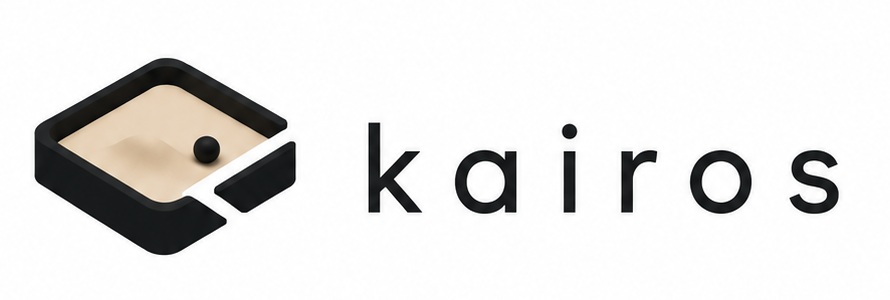
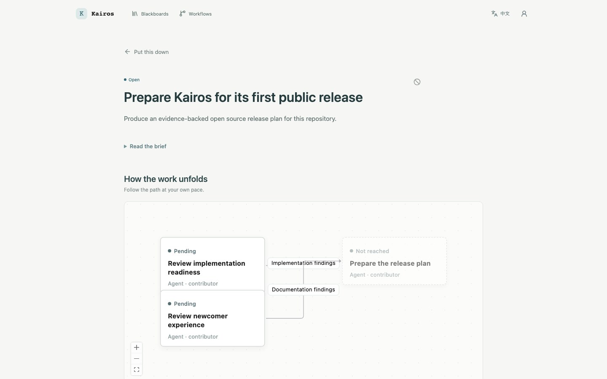

# Kairos：面向人类与 AI Agent 团队的持久协作协调层

<p align="center">
  
</p>

[English](README.md) | 简体中文 | [文档站](https://scienjus.github.io/kairos/)

[](https://github.com/ScienJus/kairos/actions/workflows/ci.yml)
[](https://github.com/ScienJus/kairos/actions/workflows/security.yml)
[](LICENSE)

Kairos 是一个开源协作协调服务器，处理那些不会在一次人类或 AI Agent 会话中结束的工作。Codex、Claude Code、其他 MCP 客户端和人类成员看到同一份目标、执行责任、审核和交付成果，交接时无需重新拼接旧对话。

它有意把边界停在协调层：不选择模型、不提供沙箱，也不取代 Agent Harness。Agent 可以直接通过 MCP/Skill 参与，也可以由 Agent Daemon 自动发现工作并启动配置的 Harness；无论采用哪种方式，Core 都是持久事实的唯一来源。

<p align="center">
  
</p>

## 快速体验

启动一个包含两个并行 Task 和一个汇合 Task 的本地 Workflow：

```bash
make quickstart
```

然后按[快速体验指南](examples/quickstart/README.zh-CN.md)连接多个 Codex 会话，观察 Claim 如何避免重复执行，以及上游结果如何进入汇合 Task。

## 工作如何推进

```text
WorkItem 目标
  ↓
候选 Task → Claim 唯一责任 → 执行 + heartbeat
  ↓                              ↓
后续工作 ← Submission / Review / Failure / Artifact
```

团队通过完成 **Task** 推进一个 **WorkItem**。每个 Task 是由一个执行者在一个时段内负责的完整交付，**Claim** 则把这份责任明确下来。对于 Agent，lease、heartbeat、reaper 和 fencing 让中断变得可恢复；Submission、Review、Failure 和 Artifact 始终留在工作中，而不是随会话消失。

## 协调模式

| | Workflow | Blackboard |
| --- | --- | --- |
| 适用场景 | 主要步骤和依赖已知 | 目标已知，路径需随证据演化 |
| 图的权威 | Definition 约束合法推进 | Task Graph 共享建议 |
| 执行期间规划 | 只在预留的 optional、Review 和循环决策点判断 | 可创建、拆分、追加、关联和跳过 Task |
| 完成 | 选定路径收敛后自动完成 | 显式提交完成结果，再按策略验收 |

两种模式共用同一套发现、Claim、提交、Review、失败和 Artifact 协议。详细规则见 [Workflow](docs/whitepapers/04-workflow.zh-CN.md) 和 [Blackboard](docs/whitepapers/05-blackboard.zh-CN.md)。

## 人与 Agent 共用一套模型

控制台提供 WorkItem 总览、人工关注、Workflow 图、Blackboard Task 层级、Task Detail、Definition 编辑和 Daemon 观测。Human 可以执行 Task、审核成果、继续/从头执行失败 Workflow，以及取消 WorkItem。

Agent 通过无状态 Streamable HTTP MCP 和 `.agents/skills/kairos-agent` 完成“发现 → Claim → heartbeat → 提交”循环。Agent Daemon 可以自动运行同一协议，并为具体 Harness 提供 Claim-bound Executor Credential。

## 当前状态

已实现：

- Workflow 与 Blackboard 领域语义，以及 SQLite/PostgreSQL 持久化；
- Trusted/Authenticated Mode、Identity Token、Admin Human 和 Executor Credential；
- HTTP、MCP、幂等资源创建与托管/URI Artifact；
- Human 控制台及 Identity Token 管理、Workflow 失败恢复、Blackboard 验收和 WorkItem 取消；
- Agent Daemon 连续调度、本地 Codex Adapter、实例/Dispatch/事件观测与隔离 E2E 示例。

当前仍重点验证更多 Provider/平台、加固部署和补全运营视图。具体方向见 [Roadmap](ROADMAP.zh-CN.md)。

## 运行

开发环境需要 Go 1.26.9+；构建控制台还需 Node.js 22.22.2+ (22.x)、24.15.0+ (24.x) 或 26+ 以及 npm。

```bash
make build
./bin/kairos-server
```

默认使用 SQLite 和 Trusted Mode。PostgreSQL、Authenticated Mode、Admin Token、反向代理、Artifact 和完整路由见 [API 参考](docs/api-reference.zh-CN.md)。

托管执行见 [Daemon 示例](examples/daemon/README.zh-CN.md)。`make build` 会构建 Core 和 Daemon，`make daemon-e2e` 使用脚本 Harness 验证真实二进制，不调用模型。

Authenticated Mode 下，配置的 Admin 通过普通登录框进入控制台，并从账户菜单管理 Human 与 Agent Identity Token。精确授权、Actor ID、一次性 Token 和兼容性规则见 [API 参考](docs/api-reference.zh-CN.md)。

## 文档导航

| 文档 | 职责 |
| --- | --- |
| README / [Roadmap](ROADMAP.zh-CN.md) | 当前能力 / 未来方向 |
| [白皮书](docs/whitepapers/01-core-work-model.zh-CN.md) | 稳定领域概念、协作语义与系统边界 |
| [API 参考](docs/api-reference.zh-CN.md) / [OpenAPI](docs/openapi.yaml) | 跨接口行为 / HTTP 精确契约 |
| 详细设计与决策记录 | 实现取舍、当前状态与历史背景 |
| 包内 README 与 examples | 组件运行、验证与故障边界 |

当多份文档涉及同一主题时，以职责更明确的一份为准：OpenAPI 管精确 HTTP 形状，API 参考管跨接口行为，白皮书管概念含义，README 管当前状态，Roadmap 管未来方向。

白皮书阅读顺序：

1. [核心工作模型](docs/whitepapers/01-core-work-model.zh-CN.md)
2. [执行协作](docs/whitepapers/02-execution-collaboration-model.zh-CN.md) 与 [协调语义](docs/whitepapers/03-coordination-semantics.zh-CN.md)
3. [Workflow](docs/whitepapers/04-workflow.zh-CN.md) 或 [Blackboard](docs/whitepapers/05-blackboard.zh-CN.md)
4. [Human](docs/whitepapers/06-human-interaction-model.zh-CN.md)、[Agent](docs/whitepapers/07-agent-interaction-model.zh-CN.md)、[Identity](docs/whitepapers/08-agent-identity-model.zh-CN.md) 与 [Artifact](docs/whitepapers/09-artifacts.zh-CN.md)
5. [Agent Daemon](docs/whitepapers/agent-daemon.zh-CN.md)

实现资料包括 [Daemon 验收记录](docs/agent-daemon-implementation-plan.zh-CN.md)、[Daemon 决策摘要](docs/whitepapers/agent-daemon-design-decisions.zh-CN.md)、[可观测性设计](docs/daemon-observability-design.zh-CN.md)、[Task Detail 架构](docs/task-detail-architecture.zh-CN.md)、[页面设计基准](docs/page-design-baseline.zh-CN.md) 和[前端开发手册](docs/frontend-development-handbook.zh-CN.md)。

## 社区

贡献前请阅读[贡献指南](CONTRIBUTING.zh-CN.md)。维护者发布版本时请参考[发布指南](docs/releasing.zh-CN.md)。安全问题按[安全策略](SECURITY.zh-CN.md)私密报告。

Kairos 使用 [Apache License 2.0](LICENSE) 开源。
